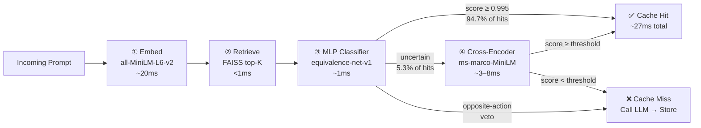

# SemanticMemo

**Semantic caching framework using FAISS retrieval, learned equivalence classification, Cross-Encoder verification, and entity-drift detection.**


[](https://github.com/rajveer100704/semanticmemo/actions)
[](https://pypi.org/project/semanticmemo/)
[](https://pypi.org/project/semanticmemo/)
[](LICENSE)

---

## The Problem: Cosine Caches Fail in Production

Every semantic cache today makes the same mistake: it decides cache hits by cosine similarity.

```
"Should I approve the refund?"   ── cosine: 0.97 ──▶  CACHE HIT  ← wrong
"Should I deny the refund?"      ─────────────────────────────────────────
```

These two prompts are 97% similar in embedding space. They require opposite responses.
A cosine threshold cannot tell them apart — and there is no threshold that fixes this.
In the medical domain, this means a cached "increase dosage" response gets served for
"decrease dosage". In finance, "buy 500 shares" gets served for "sell 500 shares".

**The result:** Teams adopt semantic caching in development, hit a false-positive incident,
rip it out, and go back to paying full LLM cost on every call. The cycle repeats.

**SemanticMemo replaces the cosine threshold with a learned, four-stage verification pipeline
that cuts hard-negative false positive rates from 33.3% to 0%.**

---

## Benchmark Results

### Hard-Negative False Positive Rate

The critical number. Hard negatives are semantically near-identical prompt pairs
that require opposite actions — the case that breaks cosine caches.

| Method | Hard-Negative FPR | False Positives / 12 pairs |
| :--- | :---: | :---: |
| Cosine Baseline (threshold=0.90) | **33.3%** ❌ | 4/12 |
| MLP Classifier | **0.0%** ✅ | 0/12 |
| Double Verification | **0.0%** ✅ | 0/12 |
| SemanticMemo | **0.0%** ✅ | 0/12 |

### Domain Comparison Matrix

Evaluated over 80 prompt pairs (4 domains × 20 pairs, 10 positive + 10 hard-negative each):

| Method | Domain | Precision | Recall | F1 | FPR |
| :--- | :--- | ---: | ---: | ---: | ---: |
| Cosine Baseline | Finance | 0.000 | 0.000 | 0.000 | 0.200 |
| MLP Classifier | Finance | 1.000 | 0.700 | 0.824 | 0.000 |
| **SemanticMemo** | **Finance** | **1.000** | **0.500** | **0.667** | **0.000** |
| Cosine Baseline | Medical | 0.400 | 0.200 | 0.267 | 0.300 |
| MLP Classifier | Medical | 0.667 | 0.600 | 0.632 | 0.300 |
| **SemanticMemo** | **Medical** | **0.714** | **0.500** | **0.588** | **0.200** |
| Cosine Baseline | Security | 0.000 | 0.000 | 0.000 | 0.200 |
| MLP Classifier | Security | 1.000 | 0.500 | 0.667 | 0.000 |
| **SemanticMemo** | **Security** | **1.000** | **0.500** | **0.667** | **0.000** |

### Classifier vs Cosine on Gold Set (84 held-out pairs)

| Method | Precision | Recall | F1 | False Positives |
| :--- | ---: | ---: | ---: | ---: |
| Cosine (at equal recall) | 0.527 | 0.935 | 0.674 | 26 |
| `equivalence-net-v1` | **0.829** | **0.935** | **0.879** | **6** |

**+30.2 precision points at equal recall.**

> Full results, latency breakdown, cost savings model, and threshold sweep report:
> [`docs/results.md`](docs/results.md)

---

## Architecture

SemanticMemo chains four stages. The first stage is permissive (high recall). Each stage
narrows the candidates. Only the final confirmed hit goes to cache.



| Stage | Component | Latency | Purpose |
| :--- | :--- | ---: | :--- |
| ① Embed | `all-MiniLM-L6-v2` | ~20ms | Dense prompt vector |
| ② Retrieve | FAISS IndexFlatIP | <1ms | Top-K candidates |
| ③ MLP | `equivalence-net-v1.pt` | ~1ms | Fast pair equivalence |
| Veto | Rule-based patterns | <0.1ms | Block opposite-action pairs |
| Bypass | MLP ≥ 0.995 | 0ms | Skip CE for certain hits |
| ④ Cross-Encoder | ms-marco-MiniLM-L-6-v2 | ~3–8ms | Deep re-ranking |

### Risk-Aware Policies

High-stakes domains (medical, finance, security, legal) use stricter thresholds automatically:

| Domain | MLP Threshold | CE Threshold |
| :--- | :---: | :---: |
| Customer Support / General | 0.90 | 0.85 |
| Medical / Finance / Security / Legal | 0.99 | 0.95 |

---

## Installation

```bash
pip install "semanticmemo[ml]"
```

The `[ml]` extra includes PyTorch, FAISS, and SentenceTransformers — required for
the embedding model and bundled classifier.

For local development:

```bash
git clone https://github.com/rajveer100704/semanticmemo
cd semanticmemo
uv sync --all-extras
uv run pytest          # 91 tests
uv run ruff check
uv run pyright
```

---

## Quickstart

### Drop-in wrapper — zero config

```python
from semanticmemo import SemanticMemo, ClassifierConfig

cache = SemanticMemo(
    domain="customer-support",
    classifier=ClassifierConfig.bundled(),   # ships with the package
)

async def call_llm(prompt: str) -> str:
    # your existing LLM call here
    return "fresh response"

result = await cache.get_or_call(
    prompt="Where is my order?",
    llm_function=call_llm,
)

print(result.response)          # cached or fresh
print(result.was_cache_hit)     # True / False
print(result.cost_saved_usd)    # Decimal, $0 on miss
print(result.latency_ms)        # full round-trip latency
```

### Production config — risk-aware, domain-aware

```python
from semanticmemo import (
    SemanticMemo, CacheConfig, ClassifierConfig,
    CrossEncoderConfig, RiskPolicy, RiskTier,
)

cache = SemanticMemo(
    domain="medical",
    config=CacheConfig(
        cross_encoder=CrossEncoderConfig(
            model_name="cross-encoder/ms-marco-MiniLM-L-6-v2",
        ),
        risk_policy=RiskPolicy(
            domain_tiers={
                "medical":  RiskTier.HIGH,
                "finance":  RiskTier.HIGH,
                "security": RiskTier.HIGH,
                "legal":    RiskTier.HIGH,
            },
            # LOW tier: customer-support, general
            low_risk_classifier_threshold=0.90,
            low_risk_cross_encoder_threshold=0.85,
            # HIGH tier: medical, finance, security, legal
            high_risk_classifier_threshold=0.99,
            high_risk_cross_encoder_threshold=0.95,
        ),
        high_precision_skip_threshold=0.995,  # bypass CE when MLP is near-certain
    ),
    classifier=ClassifierConfig.bundled(),
)

result = await cache.get_or_call(prompt="...", llm_function=call_llm)

# Explainable decision trace on every result
if result.decision:
    print(result.decision.reason)              # "mlp_bypass" / "passed_all_thresholds" / ...
    print(result.decision.risk_tier)           # "high" / "low"
    print(result.decision.classifier_score)    # float
    print(result.decision.cross_encoder_score) # float | None

# Latency profiling
print(result.embedding_latency_ms)       # ~20ms
print(result.retrieval_latency_ms)       # ~0.05ms
print(result.mlp_latency_ms)             # ~1ms
print(result.cross_encoder_latency_ms)   # ~3-8ms or 0 (bypassed)
```

---

## Feedback & Retraining

Every cache hit is recorded. Report bad hits to generate labeled training data:

```python
result = await cache.get_or_call(
    prompt="Approve the customer's refund request",
    llm_function=call_llm,
)

if result.was_cache_hit and user_rejected_answer:
    await cache.report_bad_hit(result.query_id, reason="wrong decision")

# Export feedback as training pairs
written = cache.export_feedback_pairs("data/feedback_pairs.jsonl")
```

Retrain a candidate classifier when feedback accumulates:

```bash
uv run semanticmemo retrain \
  --out models/classifier-candidate.pt \
  --validation-data data/validation_pairs.jsonl \
  --domain medical \
  --min-precision 0.95 \
  --promote-to models/classifier-active.pt
```

### Implicit Feedback (opt-in)

Re-issuing the same prompt shortly after a cache hit is auto-flagged as a bad hit:

```python
from semanticmemo import CacheConfig, ImplicitFeedbackConfig, SemanticMemo

cache = SemanticMemo(
    domain="customer-support",
    config=CacheConfig(
        implicit_feedback=ImplicitFeedbackConfig(window_seconds=30.0),
    ),
)
```

---

## Benchmarks

```bash
# Full comparison: Cosine vs MLP vs Double Verification vs SemanticMemo
uv run python benchmarks/run_benchmarks.py

# Threshold sweep (40×30 grid, per-domain FPR constraints)
uv run python benchmarks/sweep_thresholds.py

# Classifier vs cosine on gold set
uv run python benchmarks/classifier_vs_cosine.py

# High-stakes opposite-action evaluation
uv run python benchmarks/false_positive_eval.py
```

Results are saved to `benchmarks/results/`.

---

## Project Structure

```
semanticmemo/
├── src/semanticmemo/
│   ├── cache.py                    # SemanticMemo public API
│   ├── orchestrator.py             # 4-stage decision engine
│   ├── models.py                   # CacheResult, CacheDecision, CacheConfig, RiskPolicy
│   ├── domain_detector.py          # Embedding-based domain routing
│   ├── classifier/
│   │   ├── model.py                # PairClassifier (MLP nn.Module)
│   │   ├── service.py              # ClassifierService wrapper
│   │   ├── cross_encoder_service.py # CrossEncoderService + _MODEL_CACHE
│   │   ├── train.py                # Training loop
│   │   └── evaluate.py             # Evaluation metrics
│   ├── embedding/service.py        # EmbeddingService + FAISS/in-memory index
│   ├── store/sqlite_store.py       # SQLite persistence (WAL mode)
│   ├── feedback/                   # Feedback ledger + retraining trigger
│   ├── _models/equivalence-net-v1.pt   # Bundled pretrained classifier
│   └── cli.py                      # semanticmemo retrain / stats / export-feedback
├── benchmarks/
│   ├── run_benchmarks.py           # 4-method × 4-domain comparison matrix
│   ├── sweep_thresholds.py         # 1,200-config threshold grid search
│   ├── false_positive_eval.py      # High-stakes opposite-action evaluation
│   ├── data/                       # 20-pair datasets per domain + hard_negatives.jsonl
│   └── results/                    # JSON + MD benchmark outputs
├── docs/
│   ├── results.md                  # Full benchmark results (this project's showpiece)
│   ├── architecture.md             # System design
│   ├── decision_engine.md          # 4-stage pipeline deep-dive
│   └── benchmark_methodology.md    # Evaluation framework
└── tests/                          # 91 tests (pytest)
```

---

## Roadmap

**v1.1.0**
- Qdrant production backend (currently available via `CacheConfig.vector_store_type="qdrant"`, full hardening coming)
- Automated nightly retraining pipeline triggered by feedback accumulation threshold
- Multi-domain classifier training (single model, domain-conditioned)

**v1.2.0**
- OpenTelemetry trace export for `CacheDecision` spans
- Redis cache store backend (distributed caching for multi-instance deployments)
- `semanticmemo compare` CLI command: before/after precision/recall diff on any JSONL dataset

---

## Reliability

- **Resource cleanup** — `async with SemanticMemo(...) as cache:` or `cache.close()`
- **Retries** — `CacheConfig(retry=RetryConfig(...))` for transient LLM failures (off by default)
- **WAL mode SQLite** — safe for multi-threaded single-process use
- **Logging** — silent by default under `semanticmemo` logger namespace; configure to opt in
- **Type-safe** — full Pydantic v2 models throughout; pyright `basic` mode passes clean

---

## Release

Published to PyPI as `semanticmemo`. Internal import name is unchanged: `import semanticmemo`.

```bash
pip install "semanticmemo[ml]"
```

Tagged releases publish automatically via GitHub Actions trusted publishing.

```bash
git tag v1.0.0
git push origin v1.0.0
```

---

## License

MIT — see [LICENSE](LICENSE).


