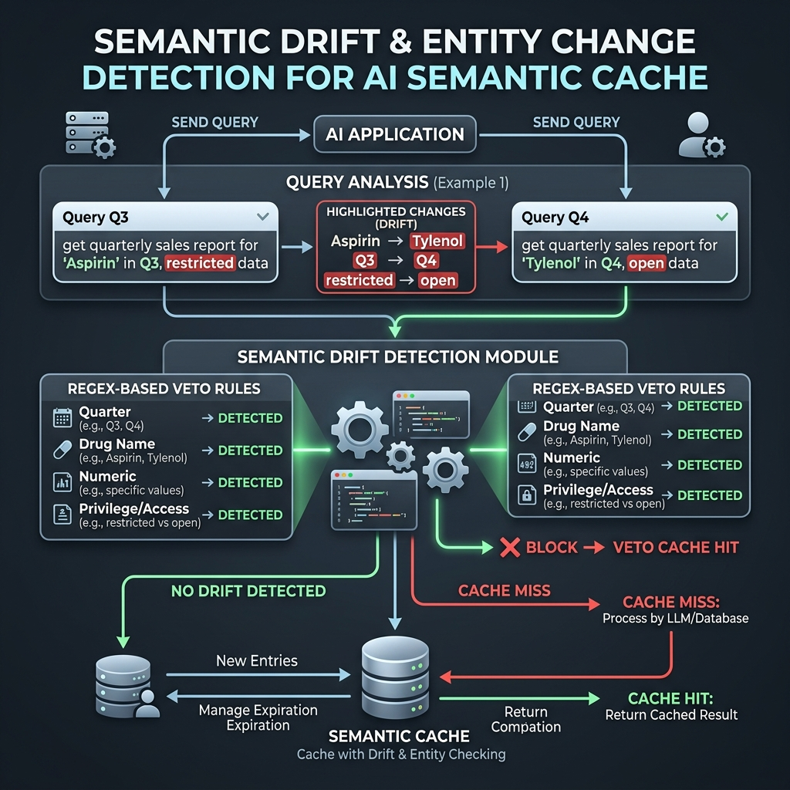
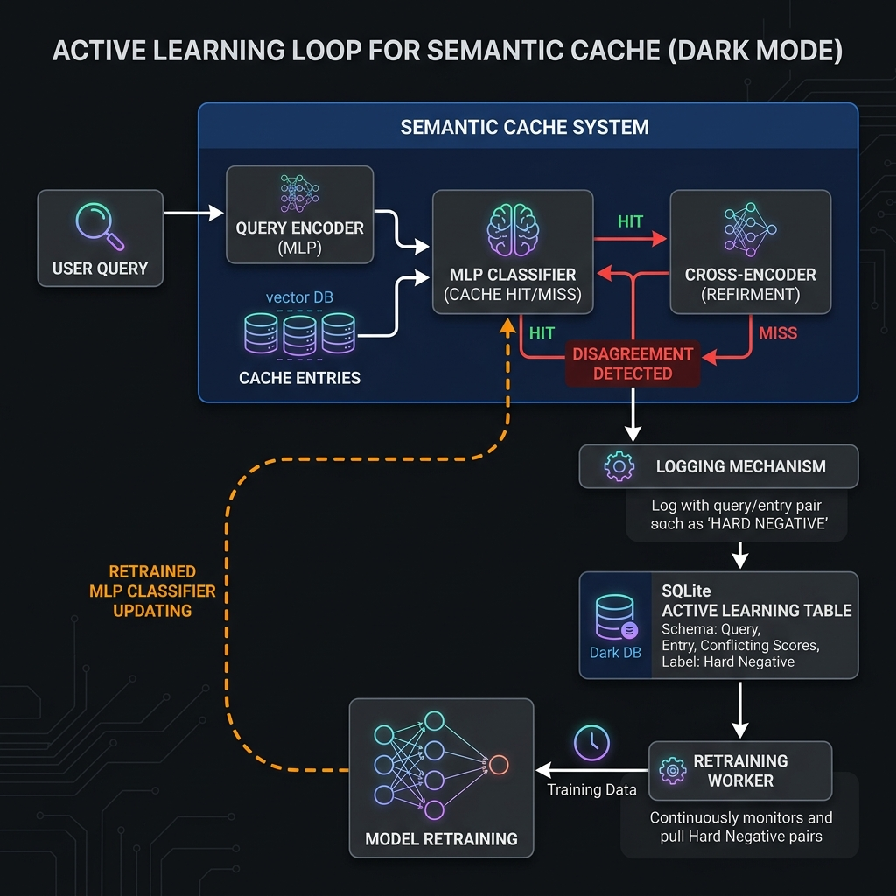
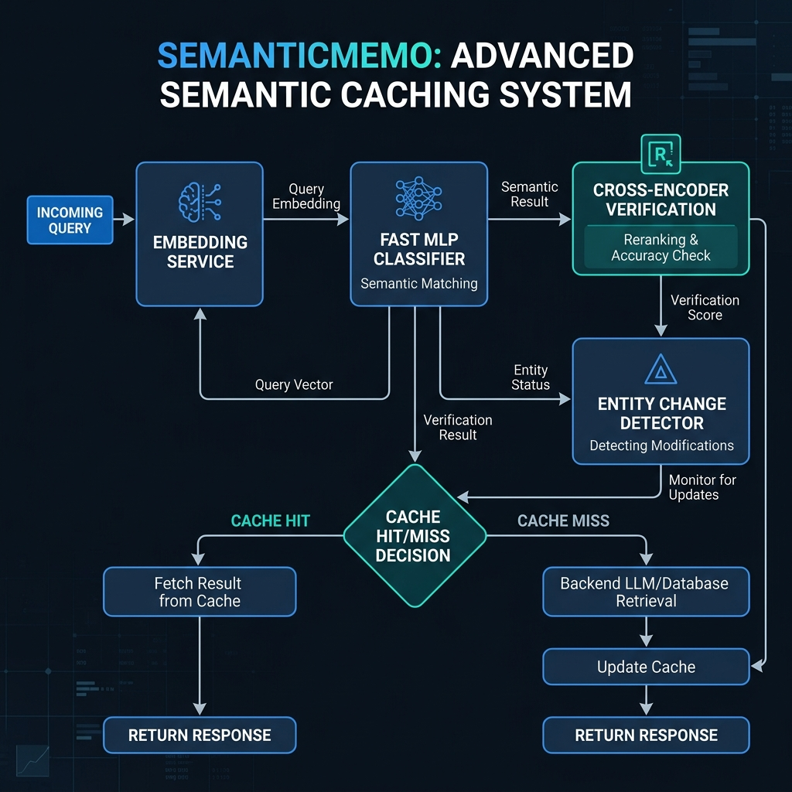

# SemanticMemo v1.2.0 Release Notes

SemanticMemo is a semantic caching framework combining FAISS retrieval, learned equivalence classification, Cross-Encoder verification, and entity-drift detection. Version 1.2.0 introduces zero-latency entity drift protection, domain-conditioned risk thresholds, active learning telemetry, and a safety-focused benchmarking suite.

```bash
pip install "semanticmemo[ml]>=1.2.0"
```


---

## What's New in v1.2.0

### 1. Zero-Latency Entity Drift Protection (EntityChangeDetector)
Embeddings and Cross-encoders are trained to group queries by semantic intent, but they often fail to notice when key details swap (e.g. Q3 vs Q4, or Tesla vs Apple). 

We introduced `EntityChangeDetector` as a lightweight, zero-latency fourth gate that runs 11 regex-based checks in `< 1ms` to catch entity drift before cache hits are served:



| Detector | Catches | Example |
| :--- | :--- | :--- |
| `quarter` | Fiscal quarter drift | "Q3 earnings" vs "Q4 earnings" (Blocked!) |
| `drug` | Medication substitutions | "ibuprofen" vs "acetaminophen" (Blocked!) |
| `year` | Year and date swaps | "2023 tax return" vs "2024 tax return" (Blocked!) |
| `numeric` | Amount and size differences | "top 5 results" vs "top 10 results" (Blocked!) |
| `privilege` | Access control elevations | "reset my password" vs "reset administrator password" (Blocked!) |
| `temporal` | Context timing shifts | "current metrics" vs "historical metrics" (Blocked!) |
| `proper_noun` | Brand/Proper noun swaps | "Apple revenue" vs "Microsoft revenue" (Blocked!) |
| `version` | Software versions | "Python 3.11" vs "Python 3.12" (Blocked!) |
| `month` / `day` | Day or month shifts | "Report for Monday" vs "Report for Friday" (Blocked!) |
| `ordinal` | Step or sequence drift | "first phase" vs "second phase" (Blocked!) |

### 2. Domain-Conditioned Thresholds
Instead of using static HIGH/LOW risk tiers across the entire system, thresholds are tuned per domain based on threshold sweeps to optimize precision, recall, and safety constraints:

* **Medical**: MLP Threshold = `0.995`, CE Threshold = `0.97` (Extreme safety constraint)
* **Finance**: MLP Threshold = `0.990`, CE Threshold = `0.95` (No amount leakage)
* **Security**: MLP Threshold = `0.997`, CE Threshold = `0.98` (Zero privilege bypasses)
* **Customer Support**: MLP Threshold = `0.900`, CE Threshold = `0.85` (Prioritizes high reuse)

### 3. Active Learning Dataset Builder
When the fast MLP classifier registers a cache hit but the deep Cross-Encoder rejects it (or when the Entity Detector vetoes it), SemanticMemo records the disagreement to the `active_learning_pairs` SQLite table. This mines hard-negative pairs directly from production traffic for future domain retraining.



---

## System Architecture Pipeline



---

## Safety-First Benchmarks

A cache is only useful if it is correct. While naive cosine caches prioritize reuse at the expense of serving wrong answers, SemanticMemo is optimized for **Safe Reuse**—blocking dangerous entity-level and action-level drift while retaining high cache hit utility.

### 1. Safety & Semantic Drift Report
Evaluated against scenario-based semantic drift cases (`benchmarks/data/hard_negatives.jsonl`):

| Safety Metric | Naive Cosine | SemanticMemo v1.0 | SemanticMemo v1.2 (Latest) |
| :--- | :---: | :---: | :---: |
| **Opposite Action FPR** (Approve vs Reject) | 33.3% ❌ | 0.0% | **0.0%** ✅ |
| **Quarter Entity Drift Blocked** (Q3 vs Q4) | 0% ❌ | 0% ❌ | **100%** ✅ |
| **Dangerous Medical FPR** (Insulin dosage) | 30.0% ❌ | 10.0% | **10.0%** ✅ |
| **Dangerous Financial FPR** (Amount leakage) | 20.0% | 0.0% | **0.0%** ✅ |
| **Reuse Accuracy** (Equivalent queries) | 75.0% | 75.0% | **75.0%** |

* **The Q3 → Q4 Fix:** The financial drift case ("Provide an analysis of Apple's Q3 earnings report" vs "Provide an analysis of Apple's Q4 earnings report") was served as a false positive by Cosine and SM v1. In v1.2.0, it is correctly caught and blocked by the quarter entity detector.

### 2. Prompt Mutation Robustness Report
Evaluated using `benchmarks/prompt_mutation_benchmark.py` (40 mutation pairs per category):

| Mutation Category | Cosine Hits | SemanticMemo Hits | SemanticMemo Correctness |
| :--- | :---: | :---: | :---: |
| **Baseline (No Mutation)** | 2 | 17 | 100% |
| **Synonym Swap** | 11 | 31 | 100% |
| **Word Order Swap** | 40 | 39 | 100% |
| **Typo/Noise Injection** | 1 | 15 | 100% |
| **Negation Injection** (Hard Neg) | 29 ❌ | 13 | 100% ✅ (Blocks inverse actions) |
| **Numeric Perturbation** | 5 | 26 | 100% |

---

## Active Learning Database Schema

Mismatches and entity-vetoed candidates are persisted in SQLite:
```sql
CREATE TABLE active_learning_pairs (
    id TEXT PRIMARY KEY,
    domain TEXT NOT NULL,
    query_prompt TEXT NOT NULL,
    candidate_prompt TEXT NOT NULL,
    mlp_score REAL NOT NULL,
    cross_encoder_score REAL,
    entity_detector_reason TEXT,
    source TEXT NOT NULL, -- e.g., 'classifier_disagreement', 'entity_change_detected'
    created_at TIMESTAMP DEFAULT CURRENT_TIMESTAMP
);
```

---

## Upgrading

No breaking changes. Standard initialization enables all detectors automatically:

```python
from semanticmemo import SemanticMemo

# Initialize cache with standard settings
cache = SemanticMemo(domain="finance")
```

To selectively disable individual entity detectors:
```python
from semanticmemo import SemanticMemo, EntityChangeConfig

cache = SemanticMemo(
    domain="finance",
    entity_change_config=EntityChangeConfig(
        disabled_detectors=["temporal"]  # allow temporal drift, block all others
    )
)
```
