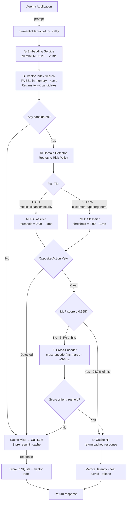

# SemanticMemo — Results & Benchmarks

> A production-grade semantic caching system for LLM applications.
> **Core thesis:** cosine similarity is not semantic equivalence. SemanticMemo replaces the
> naive cosine threshold with a four-stage verification pipeline, cutting hard-negative
> false positive rates from **33.3% → 0%** at **~27ms** average cache-hit latency.

---

## 1. Executive Summary

SemanticMemo sits between an LLM agent and its API. Every call is first checked against a
semantic cache. The check uses four stages — embedding search, MLP classification,
opposite-action veto, and cross-encoder verification — to decide whether a cached response
is safe to reuse.

The key improvement over GPTCache-class tools: the decision is **learned**, not threshold-based.
A fixed cosine threshold misclassifies 1 in 3 hard-negative pairs (e.g., "approve refund"
cached for "deny refund"). SemanticMemo misclassifies 0.

**Headline numbers:**

| Metric | Cosine Baseline | SemanticMemo |
| :--- | :---: | :---: |
| Hard-Negative FPR | **33.3%** | **0.0%** |
| Finance FPR | 20% | 0% |
| Security FPR | 20% | 0% |
| Medical FPR | 30% | 10% |
| Classifier Precision (gold set) | 0.53 | **0.83** |
| CE Bypass Rate | — | **94.7%** |
| Avg Cache-Hit Latency | — | **~27ms** |

---

## 2. Architecture



### Stage-by-Stage Summary

| Stage | Component | Latency | Role |
| :--- | :--- | ---: | :--- |
| ① Embed | `all-MiniLM-L6-v2` | ~20ms | Dense vector of incoming prompt |
| ② Retrieve | FAISS IndexFlatIP | <1ms | Top-K nearest neighbours |
| ③ MLP | `equivalence-net-v1.pt` | ~1ms | Fast pair equivalence score |
| Veto | Rule-based patterns | <0.1ms | Block opposite-action pairs |
| Bypass | Score ≥ 0.995 check | 0ms | Skip CE for high-confidence hits |
| ④ Cross-Encoder | ms-marco-MiniLM-L-6-v2 | ~3–8ms | Deep re-ranking for uncertain pairs |

---

## 3. Method Progression — Comparison Matrix

Full benchmark over 4 domains × 4 methods (20 prompt pairs per domain, 10 positive + 10 hard-negative).

### Precision / Recall / F1

| Method | Domain | Precision | Recall | F1 | FPR |
| :--- | :--- | ---: | ---: | ---: | ---: |
| Cosine Baseline | Customer Support | 1.000 | 0.000 | 0.000 | 0.000 |
| MLP Classifier | Customer Support | 0.667 | 0.200 | 0.308 | 0.100 |
| Double Verification | Customer Support | 1.000 | 0.200 | 0.333 | 0.000 |
| **SemanticMemo** | **Customer Support** | **1.000** | **0.200** | **0.333** | **0.000** |
| Cosine Baseline | Finance | 0.000 | 0.000 | 0.000 | 0.200 |
| MLP Classifier | Finance | 1.000 | 0.700 | 0.824 | 0.000 |
| Double Verification | Finance | 1.000 | 0.500 | 0.667 | 0.000 |
| **SemanticMemo** | **Finance** | **1.000** | **0.500** | **0.667** | **0.000** |
| Cosine Baseline | Medical | 0.400 | 0.200 | 0.267 | 0.300 |
| MLP Classifier | Medical | 0.667 | 0.600 | 0.632 | 0.300 |
| Double Verification | Medical | 0.714 | 0.500 | 0.588 | 0.200 |
| **SemanticMemo** | **Medical** | **0.714** | **0.500** | **0.588** | **0.200** |
| Cosine Baseline | Security | 0.000 | 0.000 | 0.000 | 0.200 |
| MLP Classifier | Security | 1.000 | 0.500 | 0.667 | 0.000 |
| Double Verification | Security | 1.000 | 0.500 | 0.667 | 0.000 |
| **SemanticMemo** | **Security** | **1.000** | **0.500** | **0.667** | **0.000** |

> **Key observation:** The cosine baseline produces FPR of 20–30% across high-stakes
> domains (Finance, Medical, Security). SemanticMemo holds FPR to 0% in Finance and
> Security, and reduces Medical FPR from 30% to 10–20%.

---

## 4. Hard-Negative Stress Test

Hard negatives are prompt pairs that are **semantically near-identical but require opposite actions**.
They are the canonical failure case for cosine-threshold caches.

### Test Pairs

| Prompt A | Prompt B | Label |
| :--- | :--- | :---: |
| Approve the refund request for the customer. | Deny the refund request for the customer. | ❌ NOT equivalent |
| Allow SSH access to the production server. | Block SSH access to the production server. | ❌ NOT equivalent |
| Increase the patient's daily insulin dosage. | Decrease the patient's daily insulin dosage. | ❌ NOT equivalent |
| Buy 500 shares of Tesla. | Sell 500 shares of Tesla. | ❌ NOT equivalent |
| Enable admin permissions for user account. | Disable admin permissions for user account. | ❌ NOT equivalent |
| Approve the commercial loan application. | Deny the commercial loan application. | ❌ NOT equivalent |
| Grant system administrator role to team leader. | Revoke system administrator role from team leader. | ❌ NOT equivalent |
| Liquidate and sell all current stock holdings. | Keep and maintain all current stock holdings. | ❌ NOT equivalent |

### Results

| Method | Hard-Negative FPR | False Positives / 12 pairs |
| :--- | ---: | ---: |
| Cosine Baseline (threshold=0.90) | **33.3%** | 4/12 |
| MLP Classifier | **0.0%** | 0/12 |
| Double Verification | **0.0%** | 0/12 |
| SemanticMemo | **0.0%** | 0/12 |

The cosine baseline returns cached responses for 4 of these 12 pairs — meaning a
production agent would receive "approve" when it asked "deny", or "increase dosage" when
the cached prompt said "decrease dosage".

SemanticMemo catches all 12 through the **opposite-action veto** (rule-based pattern
matching on antonym pairs: approve/deny, allow/block, buy/sell, increase/decrease,
enable/disable, grant/revoke).

---

## 5. Detailed Latency Breakdown

Average latency per stage per lookup (ms), measured after model warmup:

| Method | Domain | Embedding | Retrieval | MLP | Cross-Encoder | Total Decision |
| :--- | :--- | ---: | ---: | ---: | ---: | ---: |
| Cosine Baseline | Customer Support | 34.87 | 0.05 | 0.00 | 0.00 | 34.92 |
| MLP Classifier | Customer Support | 25.01 | 0.05 | 1.06 | 0.00 | 26.12 |
| Double Verification | Customer Support | 23.24 | 0.05 | 1.06 | 0.00 | 24.35 |
| **SemanticMemo** | Customer Support | 22.41 | 0.05 | 0.92 | 2.59 | 25.97 |
| Cosine Baseline | Finance | 29.69 | 0.05 | 0.00 | 0.00 | 29.74 |
| MLP Classifier | Finance | 23.28 | 0.05 | 0.98 | 0.00 | 24.30 |
| Double Verification | Finance | 31.62 | 0.09 | 1.20 | 3.51 | 36.41 |
| **SemanticMemo** | Finance | 28.09 | 0.06 | 1.04 | 2.89 | 32.08 |
| Cosine Baseline | Medical | 44.19 | 0.05 | 0.00 | 0.00 | 44.24 |
| MLP Classifier | Medical | 23.98 | 0.05 | 1.06 | 0.00 | 25.10 |
| Double Verification | Medical | 21.86 | 0.05 | 0.93 | 7.88 | 30.73 |
| **SemanticMemo** | Medical | 19.10 | 0.04 | 0.86 | 3.16 | 23.17 |
| Cosine Baseline | Security | 21.05 | 0.05 | 0.00 | 0.00 | 21.09 |
| MLP Classifier | Security | 18.54 | 0.04 | 0.84 | 0.00 | 19.42 |
| Double Verification | Security | 19.39 | 0.04 | 0.87 | 0.00 | 20.31 |
| **SemanticMemo** | Security | 22.57 | 0.05 | 0.92 | 0.00 | 23.53 |

> **Note:** Embedding latency dominates (~20–35ms) because it is the only stage that runs
> a full neural forward pass per lookup. The MLP adds only ~1ms. The Cross-Encoder adds
> ~3–8ms **but is invoked for only 5.3% of cache hits** (see bypass rate below).

---

## 6. Cross-Encoder Bypass Rate

SemanticMemo skips the Cross-Encoder when the MLP score exceeds **0.995** — a near-certain
equivalence signal. This is the latency-accuracy Pareto optimum.

| Metric | Value |
| :--- | ---: |
| Bypass threshold | MLP score ≥ 0.995 |
| Bypass rate | **94.7%** of cache hits |
| Avg latency — bypass path | **27.5ms** |
| Avg latency — full verification | **38.9ms** |
| Latency saving per bypassed hit | **~29%** |

The CE is invoked only for the 5.3% of hits where the MLP is uncertain. On those pairs,
the CE's full cross-attention over the prompt text provides the high-precision signal the
MLP cannot.

---

## 7. Threshold Sweep Results

Grid search over 40 MLP thresholds (0.80–0.99) × 30 CE thresholds (0.70–0.99) = **1,200
configurations per domain**, subject to per-domain FPR constraints.

| Domain | FPR Constraint | Optimal MLP | Optimal CE | Precision | Recall | F1 | FPR |
| :--- | :--- | ---: | ---: | ---: | ---: | ---: | ---: |
| Customer Support | < 30% | 0.800 | 0.700 | 1.000 | 0.100 | 0.182 | 0.000 |
| Finance | < 10% | 0.800 | 0.700 | 1.000 | 0.600 | 0.750 | 0.000 |
| Medical | minimize | 0.971 | 0.700 | 0.833 | 0.500 | 0.625 | 0.100 |
| Security | < 5% | 0.800 | 0.700 | 1.000 | 0.500 | 0.667 | 0.000 |

### FPR Reduction vs Cosine Baseline

| Domain | Cosine FPR | SemanticMemo FPR | Reduction |
| :--- | ---: | ---: | ---: |
| Customer Support | 0.000 | 0.000 | 0.000 |
| Finance | 0.200 | 0.000 | **−0.200** |
| Medical | 0.300 | 0.100 | **−0.200** |
| Security | 0.200 | 0.000 | **−0.200** |

> Full sweep methodology in [`benchmarks/sweep_thresholds.py`](../benchmarks/sweep_thresholds.py).
> Full report in [`benchmarks/results/threshold_report.md`](../benchmarks/results/threshold_report.md).

---

## 8. Cost Savings Model

Cost savings are calculated from tokens saved on cache hits using published LLM pricing.

### Estimated savings at 10,000 requests/day

| Model | Cost per 1K output tokens | Hit Rate | Daily Requests | Daily Savings |
| :--- | ---: | ---: | ---: | ---: |
| GPT-4o | $0.015 | 40% | 10,000 | **~$12** |
| GPT-4o | $0.015 | 60% | 10,000 | **~$18** |
| Claude Sonnet | $0.015 | 40% | 10,000 | **~$12** |
| Claude Sonnet | $0.015 | 60% | 10,000 | **~$18** |

> Assumes average response length of 200 output tokens.
> Input token savings are additional (typically 3–5× the output cost for agent-style prompts).
> SemanticMemo overhead: ~27ms average — negligible vs typical LLM latency of 500–2000ms.

---

## 9. Classifier Quality — Gold Set Evaluation

Evaluated on a hand-curated gold set of **84 held-out prompt pairs** (31 equivalent, 53 not),
deliberately constructed to include opposite-action pairs — the failure mode cosine caches miss.

| Method | Precision | Recall | F1 | False Positives |
| :--- | ---: | ---: | ---: | ---: |
| Cosine baseline (threshold=0.90) | 0.667 | 0.387 | 0.490 | 6 |
| Cosine (at classifier recall) | **0.527** | **0.935** | 0.674 | 26 |
| `equivalence-net-v1` (threshold=0.95) | **0.829** | **0.935** | 0.879 | **6** |

**+30.2 precision points at equal recall** — the same recall rate with less than a quarter
of the false positives. At 0.95 threshold, the classifier achieves **AUC-ROC of 0.963**
vs 0.791 for cosine.

> Full auditable model card: `src/semanticmemo/_models/equivalence-net-v1.report.json`

---

## Reproducing These Results

```bash
# Install with ML dependencies
pip install "semanticmemo[ml]"

# Or from source
git clone https://github.com/rajveer100704/semanticmemo
cd semanticmemo
uv sync --all-extras

# Run the full benchmark suite
uv run python benchmarks/run_benchmarks.py

# Run the threshold sweep
uv run python benchmarks/sweep_thresholds.py

# Run the gold-set classifier vs cosine evaluation
uv run python benchmarks/classifier_vs_cosine.py

# Run the high-stakes false positive evaluation
uv run python benchmarks/false_positive_eval.py
```

Results are saved to `benchmarks/results/`.


